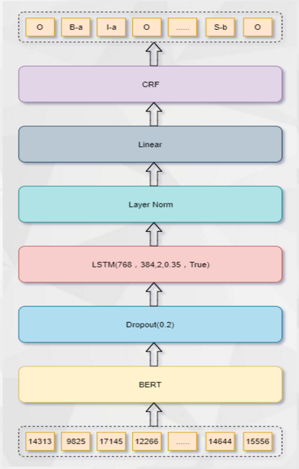
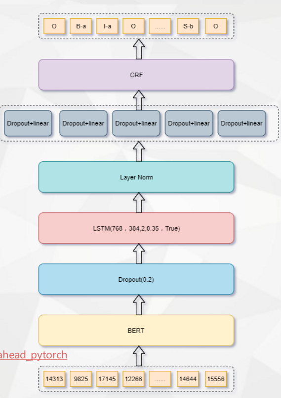
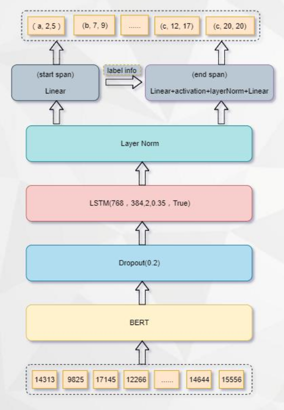
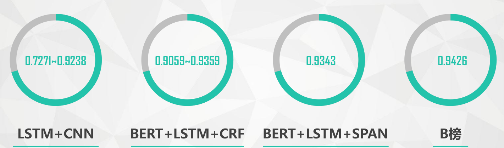

# datagrand_2019_rank9

2019年达观信息提取比赛第九名代码和答辩ppt

比赛地址：[官网](https://www.biendata.com/competition/datagrand/)

## 代码目录结构
```text
├── pydatagrand
|  └── callback
|  |  └── lrscheduler.py　　
|  |  └── trainingmonitor.py　
|  |  └── ...
|  └── config
|  |  └── basic_config.py #a configuration file for storing model parameters
|  └── dataset　　　
|  └── io　　　　
|  |  └── dataset.py　　
|  |  └── data_transformer.py　　
|  └── model
|  |  └── nn　
|  |  └── pretrain　
|  └── output #save the ouput of model
|  └── preprocessing #text preprocessing 
|  └── train #used for training a model
|  |  └── trainer.py 
|  |  └── ...
|  └── common # a set of utility functions
├── prepare_fold_data.py  # 数据切分
├── prepare_lm_data_mask.py  # 随机mask
├── prepare_lm_data_ngram.py  #ngram mask
├── run_bert_crf.py        # crf结构
├── run_bert_span.py　　　# span结构
├── train_bert_model.py　　#训练bert模型

```
## 预训练模型

主要训练了8层跟12层BERT模型，采用随机mask + ngram mask两种混合动态masking模式

## 方案1

方案1主要采用BERT+LSTM+CRF结构



## 方案2

方案2在方案1的基础上增加了MDP结构



## 方案3

方案3主要采用BERT+LSTM+SPAN结构



## 结果
最终结果如下所示：



## 文档

十强答辩ppt下载地址： https://pan.baidu.com/s/1yvXFf5GzyvDksdBKNp9FKQ 提取码: svr2

